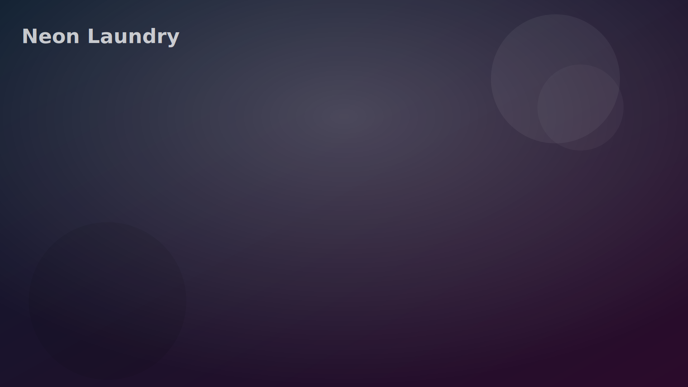
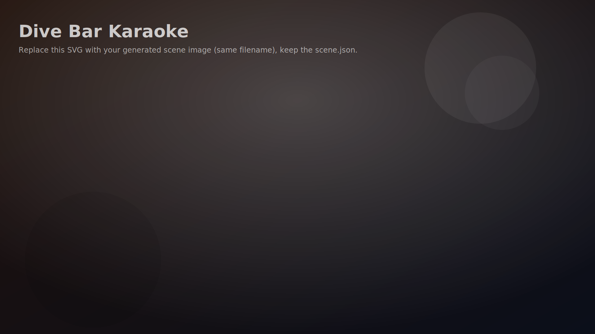

# Location Pack 02 — Locations 03 & 04

---

## 📍 Location 03 — "Neon Laundry (Spin Cycle After Dark)"

| | |
|---|---|
| **Tier** | Early–Mid Game |
| **Tone** | Flirty awkwardness + secrets |
| **Vibe** | Public place, private tension |

### 🏙 Scene Concept

A 24-hour laundromat under neon lights. Rainy night outside. Empty except them + one distant NPC (optional). Bright machines, spinning reflections, vending machine glow.

**This is the "we're alone together in public" location.**

### 🎯 Core Player Goal

**Create chemistry through micro-moments without forcing it.**

You're trying to move them from:

- strangers/friends → *"we're kinda into each other"*
- Or if they're already tense: enemies → reluctant teamwork

### 🧠 Mechanics Introduced

- Proximity & timing (interrupt or extend moments)
- Accidental intimacy triggers (shared space, small favors)
- Witness pressure (NPC / cameras alter behavior)

### 🎮 Interaction Hotspots

**🧺 The Dryer Timer**

- Add extra time (linger)
- Let it end (force decision)
- "Oops… wrong dryer" (chaos)  
- **Effects:** Tension pacing + "moment count" system

**🧼 Detergent Shelf**

- "Fresh & clean" (comfort route)
- "Heavy duty" (practical route)
- "Mystery scent" (chaos route)  
- *Hidden:* Scent becomes a memory token later

**🧃 Vending Machine**

- Buy drink/snack for both → care stat
- Buy for self only → independence
- Jam the machine → chaos mini-event

**📸 Security Camera** *(Secret)*

- If clicked: unlock "watched" variations of future scenes, or trigger paranoia/confession dialogue

### 🧨 Secrets

- **Secret Event: "Sock Portal"** — A single missing sock falls out… with a name tag / lipstick mark / receipt. Becomes a jealousy seed or a comedy bonding moment
- **Secret Path: "Laundry Confessional"** — If player keeps them waiting long enough, they start talking about something real → unlocks deeper compatibility tree

### 💞 Possible Outcomes

- Playful teasing bond
- First honest compliment
- Petty argument that becomes flirt tension
- "Accidental date" flag

### 🔐 Future DLC Hooks

- Later return: same laundromat during breakup
- Later return: same laundromat as domestic-couple moment
- DLC: "Laundry Wars" — NPC antagonist flirts with one of them

---

## 📍 Location 04 — "Dive Bar Karaoke (Last Call)"

| | |
|---|---|
| **Tier** | Mid Game Social Pressure |
| **Tone** | Bold, embarrassing, electric |
| **Vibe** | Confidence tests + jealousy triggers |

### 🌆 Scene Concept

A neon dive bar with karaoke stage. Sticky tables, dim lighting, laughter, a bartender who definitely sees everything. Music thumps softly.

This is the social arena where:

- Attraction becomes public
- Jealousy can explode
- Courage is rewarded

### 🎯 Core Player Goal

**Force a reveal.** Not necessarily romance—just truth:

- "I care"
- "I'm mad"
- "I want you"
- "I don't trust you"
- "I'm scared"

### 🧠 Mechanics Introduced

- Public choice pressure
- Audience reaction meter (later a bar or icon)
- Jealousy triggers
- Dare / challenge system

### 🎮 Interaction Hotspots

**🎤 Karaoke Signup**

- Push one to sing · Make them duet · Sabotage song choice (chaos)
- **Song archetypes:** Power ballad (confession) · Sexy track (lust spike) · Comedy song (friendship) · Angry song (resentment)

**🍻 The Drink Line**

- Buy rounds (social boost)
- Cut off (responsibility boost)
- Spill drink "accident" (chaos)

**🃏 Bar Game Corner (Darts / Pool)** — Competitive mini-event: winner chooses the next move; loser reveals something

**🚪 Bathroom Hallway** *(Secret)* — Private corridor moment: whisper argument · sudden kiss · "we can't do this" push-away

### 🧨 Secrets

- **Secret NPC: "The Ex"** — A shadowy figure in the back who recognizes one of them. Unlocks "ex history" branch or triggers instant jealousy escalation
- **Secret Item: "Karaoke Tape"** — Old recording of one of them singing years ago → unlocks nostalgia + vulnerability

### 💔 Possible Outcomes

- Public confession
- Public humiliation → resentment
- Duet success → bonding
- Fight → enemies arc
- "We're not done" unresolved tension flag

### 🔐 Future DLC Hooks

- Same bar becomes anniversary spot · or betrayal spot
- DLC: Battle of the Bands / performance arc
- DLC: "Friends drag them out" group scenes

---

*Next step: Generate Location 03 image (Neon Laundry) — clean clickable hotspots: machines, vending machine, detergent shelf, timer, camera.*
