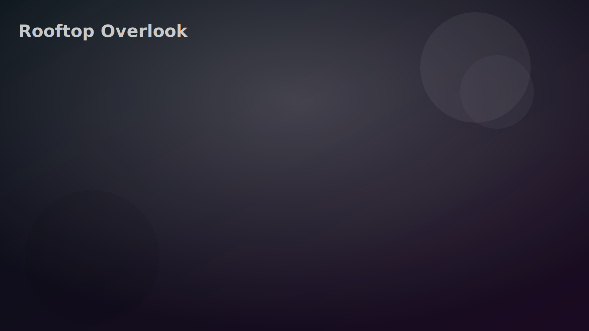
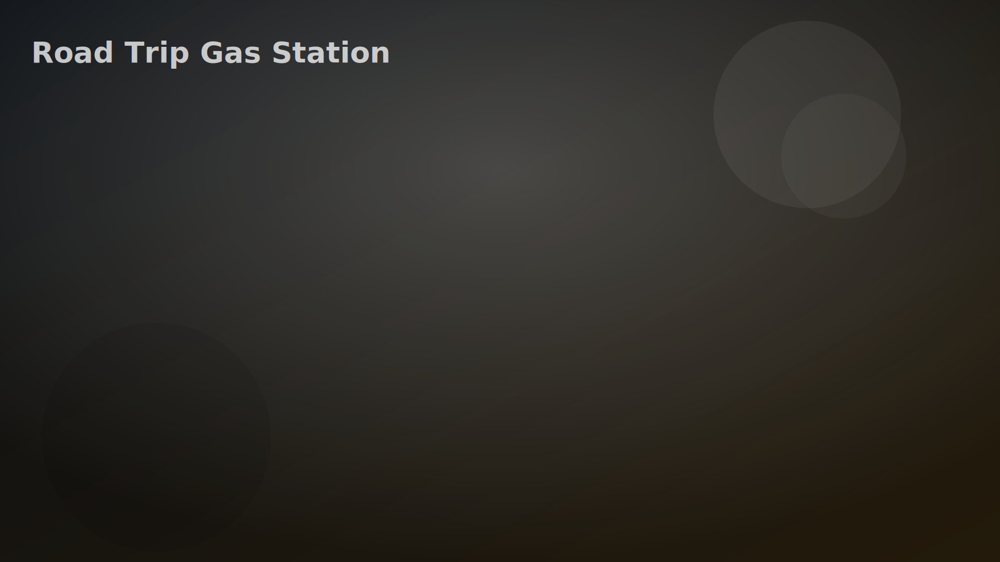

# Location Pack 03 — Locations 05 & 06

---

## 📍 Location 05 — "Rooftop City Overlook"

| | |
|---|---|
| **Tier** | Mid–Late Game Emotional Pivot |
| **Tone** | Intimate, cinematic, dangerous honesty |
| **Vibe** | The "this changes everything" scene |

### 🌆 Scene Concept

A quiet rooftop overlooking the city skyline at night.

- String lights or broken neon sign
- Warm wind
- City glow below
- Maybe a hoodie shared between them
- One sitting on ledge, one standing

**This is a gravity scene — emotionally heavy.**

### 🎯 Core Player Goal

**Force clarity.**

This is where players decide: escalation · vulnerability · or emotional retreat.  
**A defining moment location.**

### 🧠 Mechanics Introduced

- Truth threshold system
- Emotional gravity meter
- Point of no return branches

### 🎮 Interaction Hotspots

**🌃 The Ledge**

- Sit beside them (risk intimacy)
- Pull them back (care route)
- Stay back (emotional distance route)  
- **Affects:** Trust vs Fear dynamic

**🧥 Shared Jacket**

- If triggered: Warmth stat spike · Unlock physical closeness tree
- If rejected: Rejection memory stored

**📱 Phone Buzz Moment** — A text comes through mid-scene.

- Ignore it (present moment boost)
- Reveal it (truth arc)
- Hide it (future betrayal seed)

**🚬 The Edge Moment** *(Secret)* — Optional darker tone: cigarette / silence beat → unlocks deep confession paths

### 🧨 Secrets

- **"The Almost Kiss"** — If tension is built perfectly, a near-kiss triggers. Player can: let it happen · interrupt · ruin it. Becomes a long-term emotional anchor
- **"Skyline Memory"** — If they look at skyline together long enough, that skyline appears in future scenes subtly → creates visual continuity

### 💞 Possible Outcomes

- First kiss
- Confession but no action
- Emotional retreat
- Silent mutual understanding
- "We can't do this yet" slow-burn flag

### 🔐 Future DLC Hooks

- Rooftop revisited during: breakup · proposal · reconciliation
- Weather variants: rain DLC · sunrise variant · winter rooftop

---

## 📍 Location 06 — "The Road Trip Gas Station"

| | |
|---|---|
| **Tier** | Mid Game Chaos + Bonding |
| **Tone** | Playful but revealing |
| **Vibe** | Transitional space where masks drop |

### 🛣 Scene Concept

A lonely gas station at night during a road trip.

- Fluorescent lights
- Empty highway
- Car parked nearby
- Snacks, windshield bugs, music still playing

**This is a liminal space — between destinations and emotional states.**

### 🎯 Core Player Goal

**Expose real personalities.**

This location reveals: compatibility · annoyance tolerance · humor chemistry

### 🧠 Mechanics Introduced

- Compatibility meter
- Petty conflict system
- Shared journey flags

### 🎮 Interaction Hotspots

**⛽ Gas Pump**

- Help pump gas (teamwork)
- Stay in car (distance)
- Mess with music (chaos)  
- **Affects:** Partnership alignment stat

**🥤 Snack Run** — Inside gas station:

- Pick snacks for both (care)
- Weird combo choices (humor bonding)
- Forget theirs (resentment seed)

**🚗 The Car Stereo**

- Throwback songs → nostalgia unlock
- Loud chaos music → fun bond
- Sad songs → emotional deep dive

**🌌 The Open Road View** *(Secret)* — Click the dark highway → unlocks future "run away together" arc

### 🧨 Secrets

- **"Bug Splatter Confession"** — They notice bugs all over windshield. One says something real like "We're kinda like this, huh?" → unlocks metaphor-heavy dialogue trees
- **"Stranger Interaction"** — Random NPC appears. Player can: engage · ignore · use them to spark jealousy → creates branching social variants later

### 💞 Possible Outcomes

- Deep laughter bonding
- First real incompatibility moment
- "We're good together on the road" flag
- Annoyance that simmers later

### 🔐 Future DLC Hooks

- Full road trip chapter expansion
- Motel night scenes
- Getting lost arcs
- Car breakdown emotional scenes

---

*Next: Generate Location 05 image (Rooftop Overlook) — cinematic flagship scene.*
