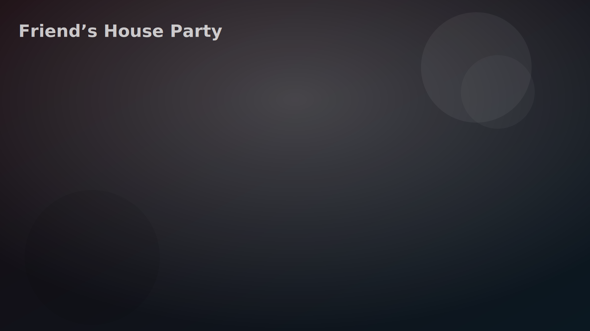
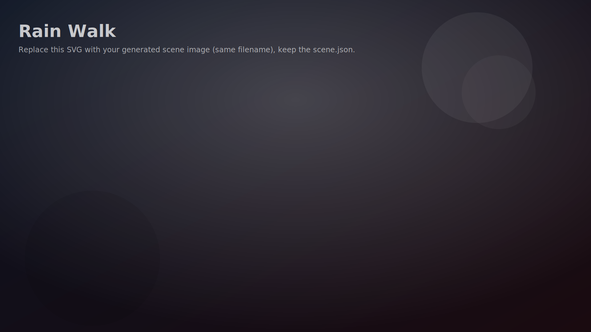

# Location Pack 04 — Locations 07 & 08

These push into **deeper emotional complexity + long-term replay value**.

- ➡️ Mid–Late game
- ➡️ Heavier consequences
- ➡️ Big branching potential

---

## 📍 Location 07 — "The Friend's House Party"

| | |
|---|---|
| **Tier** | Mid Game Social Chaos |
| **Tone** | Loud, messy, unpredictable |
| **Vibe** | Too many people, not enough privacy |

### 🏠 Scene Concept

A crowded house party hosted by mutual friends.

- Music in multiple rooms
- Red cups everywhere
- People flirting, arguing, laughing
- Rooms with different vibes (kitchen, couch room, balcony)

**This is a social pressure cooker.** You're managing: attention + jealousy + perception.

### 🎯 Core Player Goal

**Control how others influence their relationship.**

This is where outside opinions start shaping the dynamic.

### 🧠 Mechanics Introduced

- Social influence system
- Jealousy escalation
- Reputation flags
- Third-party interference

### 🎮 Interaction Hotspots

**🍻 Kitchen Island (Gossip Hub)** — NPCs talk about one of them · their past · rumors.

- Intervene
- Let rumors spread
- Twist the narrative (chaos cupid move)

**🛋 Couch Circle** — Group truth-or-dare energy.

- Push daring moments
- Protect one of them
- Let them get embarrassed  
- **Affects:** Confidence vs resentment stats

**🎶 Music Control** — Someone hands you aux control (Cupid mechanic moment).

- Romantic track → tension spike
- Party hype → deflection
- Sad song → vulnerability unlock

**🌙 Balcony Escape** — Private emotional pocket. Mini version of rooftop scene but rawer: quiet talk · argument · unexpected confession

### 🧨 Secrets

- **"The Friend Who Knows"** — One NPC actually knows history between them. If clicked → unlock hidden lore branches. This character can become: ally · saboteur · DLC narrator
- **"Public Almost-Kiss"** — If tension is high and music drops, a near-kiss happens in front of others. Player decides: let it happen (reputation shift) · interrupt (slow burn preserved) · ruin it (chaos spike)

### 💞 Possible Outcomes

- Social bonding moment
- Public embarrassment
- Third-party jealousy arc
- Friend group alignment shift
- "Everyone knows now" flag

### 🔐 Future DLC Hooks

- Wedding party variant
- Breakup party revisit
- Friend group loyalty system
- Rival introduced through social circle

---

## 📍 Location 08 — "The Rain Walk (No Destination)"

| | |
|---|---|
| **Tier** | Late Game Emotional Drift |
| **Tone** | Quiet, raw, introspective |
| **Vibe** | Walking just to avoid going home |

### 🌧 Scene Concept

Walking together in the rain at night.

- No umbrellas or one shared
- Wet pavement reflections
- Streetlights stretching endlessly
- No clear destination

**This is a movement-based emotional scene.** Not about events. About what isn't said.

### 🎯 Core Player Goal

**Guide emotional direction without forcing dialogue.**

This is where silence becomes gameplay.

### 🧠 Mechanics Introduced

- Silence management
- Walking speed choices
- Emotional pacing system
- Internal monologue triggers

### 🎮 Interaction Hotspots

**🚶 Walking Speed** — Player subtly controls:

- Slow walk (intimacy)
- Fast walk (avoidance)
- Stop walking (turning point trigger)  
- **Affects:** Emotional gravity meter

**🌧 Shared Umbrella** *(if present)*

- Pull closer
- Give them umbrella
- Step away into rain  
- **Outcomes:** Care vs sacrifice vs distance

**🏙 Puddle Reflections** — Clicking reflections reveals: past memories · possible futures · emotional symbolism. Visual storytelling mechanic.

**🚦 Crosswalk Moment** — They pause under a streetlight. Player decides: say something real · joke · stay silent. *Huge branch trigger.*

### 🧨 Secrets

- **"Laugh in the Rain"** — If player introduces humor after tension → unexpected joy moment unlocks. One of the strongest bonding flags in the game
- **"Wet Hand Hold"** — If timing is perfect, their hands brush accidentally. Player can: hold · let go · pretend it didn't happen. Massive ripple effects later

### 💞 Possible Outcomes

- Quiet emotional connection
- Mutual unspoken understanding
- Emotional distance solidified
- Soft reconciliation
- "We almost said it" memory flag

### 🔐 Future DLC Hooks

- Rain becomes recurring emotional motif
- Storm variants
- Walking in snow mirror scene
- Future scene where only one walks alone

---

*Next options: Generate Image 7 (House Party) with tons of clickable micro-zones · or go darker (hospital, airport goodbye) · funnier (theme park, beach chaos) · or build boss-tier emotional locations.*
